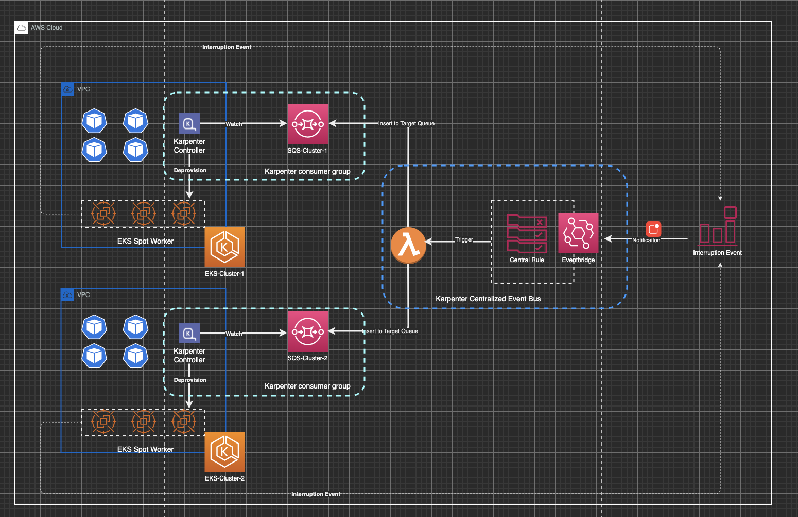

# 基于karpenter的多集群Spot Interruption事件处理总线设计
## 项目背景
Karpenter是AWS提出的kubernetes工作节点动态伸缩工具，其区别于CA（Cluster AutoScaler），具有Groupless，效率高，跟AWS集成更为紧密等众多优势。目前，越来越多的客户开始使用Karpenter来简化和优化他们的EKS集群自动扩展流程。特别是对于那些需要快速增加或减少节点数量以适应流量波动的企业来说，Karpenter可以帮助他们更好地管理他们的资源。另外采用Spot作为EKS的工作节点也成为了很多客户节约成本的一大重要手段。在Karpenter中，对于如何处理Spot实例回收带来的不稳定性影响，提供了两种方案：
* 方案1: 基于NTH（node termination handler）
* 方案2: 基于Evenbridge的事件触发机制（社区默认方案）

对于方案1，之前已经有很多文章进行了相关阐述，如[Kubernetes 节点弹性伸缩开源组件 Karpenter 实践：使用 Spot 实例进行成本优化](https://aws.amazon.com/cn/blogs/china/kubernetes-node-elastic-scaling-open-source-component-karpenter-practice-cost-optimization-using-spot-instance/). 本文主要的目的是对于方案2进行阐述，并提供了在实际应用场景中，如何基于Fan-out的理念使其更优雅的对多集群Interruption事件进行处理。

## 方案介绍

首先查看其目前设计的基本原理


其基本的逻辑为：
* 当对应EKS集群底层的Spot节点面临回收等事件时，触发EvenBridge Rule, 其详细的匹配如下
    * Spot Interruption Warnings
    * Scheduled Change Health Events 
    * Instance Terminating Events
    * Instance Stopping Events
* 每创建一个EKS集群，都对应的创建一组EvenBridge Rule和SQS对，用以接受和传递Interruption事件
* 通过配置KarpenterController的configmap指向对应集群的SQS，来消费/处理上述事件

其中如果在单账户单region集群小的情况下，上述的设计并无不妥。但是，在实验中我们发现当集群数量的多时候我们会发现几个明显的问题

* 需要为每一个集群都创建一套规则，但是规则的内容却完全一样
  > 目前相关事件无法传递tag和基于tag过滤
* 因为规则完全相同，任一集群发生的相关事件会发送到其他队列的SQS队列中进行消费
  > 查看源码可知，如果是非本集群消息，会直接进行删除

基于设计带来的管理复杂性问题，笔者协同客户首先进行了解耦的设计. 在进行详细阐述前，我们首先回顾下，在官方文档中如何进行Karpenter及相关Interruption处理组件的安装.

1. 安装Interruption处理组件和初始化集群,[参考](https://karpenter.sh/v0.27.3/getting-started/getting-started-with-karpenter/)
   
   在初始化配置中，提供了一个Cloudformation模版，其除了基本的Karpenter所需要的Role和权限等设置，还配置了对应的SQS队列和4个以其为目标的Evenbridge rule，如下:
   ```
   KarpenterInterruptionQueue:
    Type: AWS::SQS::Queue
    Properties:
      QueueName: !Sub "${ClusterName}"
      MessageRetentionPeriod: 300
   ScheduledChangeRule:
    Type: 'AWS::Events::Rule'
    Properties:
      EventPattern:
        source:
          - aws.health
        detail-type:
          - AWS Health Event
      Targets:
        - Id: KarpenterInterruptionQueueTarget
          Arn: !GetAtt KarpenterInterruptionQueue.Arn
    SpotInterruptionRule:
        Type: 'AWS::Events::Rule'
        Properties:
        EventPattern:
            source:
            - aws.ec2
            detail-type:
            - EC2 Spot Instance Interruption Warning
        Targets:
            - Id: KarpenterInterruptionQueueTarget
            Arn: !GetAtt KarpenterInterruptionQueue.Arn
    RebalanceRule:
        Type: 'AWS::Events::Rule'
        Properties:
        EventPattern:
            source:
            - aws.ec2
            detail-type:
            - EC2 Instance Rebalance Recommendation
        Targets:
            - Id: KarpenterInterruptionQueueTarget
            Arn: !GetAtt KarpenterInterruptionQueue.Arn
    InstanceStateChangeRule:
        Type: 'AWS::Events::Rule'
        Properties:
        EventPattern:
            source:
            - aws.ec2
            detail-type:
            - EC2 Instance State-change Notification
        Targets:
            - Id: KarpenterInterruptionQueueTarget
            Arn: !GetAtt KarpenterInterruptionQueue.Arn
    ```
    初始化完毕后会再进行相关集群的安装(已有集群也可，本文不详细赘述)
2. 进行Karpenter的安装
   ```
   helm upgrade --install karpenter oci://public.ecr.aws/karpenter/karpenter --version ${KARPENTER_VERSION} --namespace karpenter --create-namespace \
    --set serviceAccount.annotations."eks\.amazonaws\.com/role-arn"=${KARPENTER_IAM_ROLE_ARN} \
    --set settings.aws.clusterName=${CLUSTER_NAME} \
    --set settings.aws.defaultInstanceProfile=KarpenterNodeInstanceProfile-${CLUSTER_NAME} \
    --set settings.aws.interruptionQueueName=${CLUSTER_NAME} \
    --wait
    ```
    其中 
    ```
    --set settings.aws.interruptionQueueName=${CLUSTER_NAME}
    ```
    即为启动karpenter controller对于步骤1中配置的事件和SQS队列消息的监听和处理。

回顾完原始的步骤后，首先进行拆解的设计为，只在第一个集群的配置中配置Eventbridge Rule，后续集群只创建对应的SQS队列并动态在上述Rule中的添加新的SQS队列为Target。然而参照官方文档可知，同一条Eventbridge Rule最大的触发Target为5，并且为硬限制不可修改。考虑到该方案的局限性，顾并不对此方案进行进一步探讨。但是我们应用同样的解耦思路进行下一方案的探索。

## 基于Lambda Fan-Out改进方案介绍及测试
### 方案介绍

借鉴SNS+SQS的Fan-out设计，并结合不同事件需要分发到不同SQS的需求，故采用基于Lambda替代SNS，进行事件的精准分发，项目的架构如下所示：

其整体的流程为：
* 在第一个集群中生成中，配置全套的lambda和监听事件，在后续的集群/karpenter的安装中只生成对应集群的SQS和配置监听
* 当对应集群有Interruption事件产生时，lambda函数基于instance-id判断发生事件的集群，从而把对应的事件指向性投递到队列中
* Karpenter通过监听队列，进行对应Interruption事件的处理


### 使用FIS（Fault Ingestion simulator）来进行模拟测试

配置测试事件

执行测试


## 总结

本文阐述了一种在客户在基于karpenter进行多集群Interruption事件管理的优化设计，其从易用性和可维护性等多个角度都进行了改善。目前遗留的最大问题还是在很多EventBridge事件中无法进行对应节点Tag的传递，从而产生了很多无效的调用，希望后续能够得到完善，从而进一步简化调用的流程。另外从成本的角度来说，可以在本文的RouterLambda前再配一集中化的SQS，即所有事件统一发送到该SQS，利用Lambda的Batch机制批量处理对应请教，然后再进行批量的发送到指定下游队列中。


## 参考文档
Karpenter: https://karpenter.sh/v0.27.3/getting-started/getting-started-with-karpenter/

Karpenter处理Interruption：https://karpenter.sh/v0.27.3/concepts/deprovisioning/, https://github.com/aws/karpenter/blob/9d9fcb44b59f4f676e28351cd39790f8ef95d5a1/designs/deprovisioning.md

Karpenter源代码逻辑：https://github.com/aws/karpenter/blob/7afa5630980556742b2337574757dea9f9b99a29/pkg/controllers/interruption/controller.go


